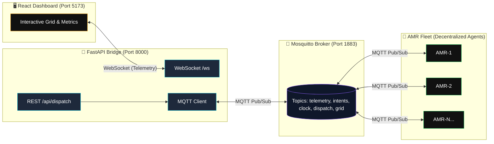

# 🚀 Decentralized AMR Fleet Coordination Framework - SIH 2026

[](https://opensource.org/licenses/MIT)
[](https://www.python.org/)
[](https://reactjs.org/)
[](https://www.docker.com/)

---

## Overview

This project implements an **edge-computed, decentralized fleet management system** for Autonomous Mobile Robots (AMRs) in warehouse environments. Designed for the **Smart India Hackathon (SIH) 2026**, it demonstrates how a fleet of robots can coordinate without a central path planner—each robot independently computes collision-free paths using **Time-Space A*** while sharing intent via **MQTT** for peer-to-peer negotiation. A **FastAPI + WebSocket** bridge provides real-time Command & Control (C2) visibility to a **React** dashboard.

### Key Capabilities
- **Zero central scheduler** — robots negotiate space-time reservations peer-to-peer
- **Contract Net Protocol (CNP)** — decentralized P2P task auctions based on distance and battery SoC
- **Provably safe** — vertex and edge collision avoidance via dynamic space-time reservations
- **Sub-millisecond planning (<0.5 ms)** — rolling 60-tick reservation pruning with per-path conflict detection
- **Fault-resilient & recoverable** — realistic sabotage simulation, dead node static obstacle avoidance, and manual fleet recovery
- **Production-ready stack** — containerized with Docker, observable via live telemetry HUD

---

## ✨ Key Features

- **Decentralized Collision Avoidance** — Time-Space A* with vertex/edge conflict checks against peer reservations
- **Contract Net Protocol (CNP) Transparency** — P2P task auctioning with live terminal visibility into decentralized bid evaluations: $\text{Cost} = f(\text{Manhattan distance}, \text{SoC battery})$
- **4D Time-Space A* & Rolling Reservation Pruning** — Bounded 60-tick search horizon with automatic pruning of expired coordinates (`t < current_tick`), yielding <0.5 ms planning latency and accurate per-path conflict tracking
- **Fault Injection & Fleet Recovery** — Built-in sabotage engine where killed units retain their real drained battery state, surviving peers treat dead units as static obstacles, and supervisors execute manual fleet recovery
- **Dynamic Replanning** — Automatic yield/replan when conflicts detected (higher ID yields)
- **Live Battery Telemetry** — Simulated drain (0.5%/move, 0.1%/idle) with visual progress bars and persistent SoC state
- **Interactive UI Dispatch (C2)** — Click any grid cell to dispatch selected robot or broadcast task RFPs via REST → MQTT → Agent
- **Real-time Dashboard** — WebSocket-fed 10×10 grid, per-robot metrics, live terminal log, and telemetry HUD

---

## 🏗 Architecture



### Data Flow
1. **Simulator** publishes clock ticks → all agents advance
2. **Tasks & CNP Auctions** — Operator/WMS issues task RFP → idle agents evaluate bid costs and claim contracts
3. **Agents** plan paths with 4D Time-Space A* (<0.5 ms) → broadcast `fleet/intents` (space-time reservations)
4. **Peers** receive intents → prune expired coordinates (`t < current_tick`) → update reservations and detect conflicts
5. **Agents** publish `fleet/telemetry` → FastAPI bridges to WebSocket → Dashboard telemetry HUD
6. **Faults & Recovery** — Sabotaged nodes persist drained SoC and become static obstacles; operators restore fleet via `/api/revive`

---

## ⚡ Core Coordination & Resilience Architecture

### 1. Contract Net Protocol (CNP) Transparency
Task allocation operates completely decentralized via peer-to-peer auction negotiation:
- **Request for Proposals (RFP):** Unclaimed targets are announced via `fleet/tasks` (or injected via `/api/tasks`), emitting `[TASK RFP]` events.
- **Decentralized Bid Evaluation:** Idle or docked robots evaluate bids based on distance and battery State of Charge (SoC):
  $$\text{Cost} = f(\text{Manhattan distance}, \text{SoC battery}) = \text{dist} + 0.1 \times (100 - \text{SoC})$$
- **Terminal Observability:** Live auction bidding and awards are broadcasted to the operator terminal HUD:
  ```text
  [TASK RFP] Broadcasted target @ (6, 8) to fleet auction pool
  [CNP AUCTION] AMR-1 claimed task | Cost: 5.2 (dist: 5, batt: 98%)
  [WMS RFP] Injected task contract @ (6, 8) -> Auction awarded to AMR-1
  ```

### 2. 4D Time-Space A* Pruning & High-Performance Pathfinding
Dynamic reservations scale predictably without memory degradation or state explosion:
- **Rolling 60-Tick Reservation Pruning:** Spacetime reservations are strictly bounded to a 60-tick rolling horizon. Expired spacetime coordinates where `t < current_tick` are automatically purged from memory on each tick and incoming peer intent.
- **$O(1)$ Spacetime Lookups:** Active reservations are converted into a flat coordinate set `(x, y, t)` for constant-time vertex and edge-swap conflict evaluation.
- **Sub-Millisecond Planning Latency (<0.5 ms):** Path computation completes in under **0.5 ms** per search query.
- **Per-Path Conflict Detection:** Proactive conflict metrics record genuine detours and wait-steps once per planned trajectory rather than inflating counters on every exploratory node expansion in the A* open set.

### 3. Fault Injection & Fleet Recovery Mechanics
The framework includes industrial-grade fault resilience and supervisor controls:
- **Realistic Sabotage Mechanics:** Simulated node failure via `/api/sabotage/{agent_id}` marks an agent as `DEAD`. The failed AMR retains its real drained battery level (SoC) and position rather than resetting or zeroing telemetry.
- **Dead Units as Static Obstacles:** Surviving AMRs automatically identify dead nodes (`status == "DEAD"`) and incorporate them into `static_obstacles` (`solid_peers`). Subsequent Time-Space A* searches seamlessly reroute around the disabled robot without grid deadlocks.
- **Manual Fleet Recovery:** Prevents arbitrary automatic resurrection. Fleet supervisors execute manual recovery through `/api/revive` (or the dashboard **Revive Fleet** button), clearing sabotaged states, resetting conflict counters, and restoring the fleet to active service.

---

## 🚀 Quick Start (Docker)

```bash
# Clone and enter
git clone https://github.com/SoulViper07/sih-amr-fleet.git
cd sih-amr-fleet

# Build and run all services
docker-compose up --build
```

| Service | URL |
|---------|-----|
| **Dashboard** | http://localhost:5173 |
| **API Docs (Swagger)** | http://localhost:8000/docs |
| **MQTT Broker** | localhost:1883 |

> **Note:** Ensure ports 1883, 5173, 8000 are free. On first run, Docker will pull images and install dependencies (~2-3 min).

---

## 🛠 Local Development (3-Terminal Setup)

### Terminal 1 — MQTT Broker
```bash
# Option A: Docker (recommended)
docker run -d -p 1883:1883 -v $(pwd)/mosquitto.conf:/mosquitto/config/mosquitto.conf eclipse-mosquitto:latest

# Option B: Local install
mosquitto -c mosquitto.conf -v
```

### Terminal 2 — FastAPI Bridge + Simulator
```bash
cd sih-amr-fleet
python -m venv venv && source venv/bin/activate  # Windows: venv\Scripts\activate
pip install -r requirements.txt

# Start API bridge (background)
uvicorn backend.api:app --host 0.0.0.0 --port 8000 --reload &

# Run simulation coordinator (sends clock ticks)
python scripts/sim_runner.py
```

### Terminal 3 — React Dashboard
```bash
cd sih-amr-fleet/frontend
npm install
npm run dev
# Opens http://localhost:5173
```

---

## 🧪 Testing the System

1. Open **Dashboard** at http://localhost:5173
2. Verify **Live** indicator (green) and active robots on grid (AMR-1 and AMR-2)
3. Click **Commander Controls** → Select **AMR-1** or **AMR-2**
4. Click any **empty grid cell** → Observe the decentralized CNP auction logs in the terminal (`[TASK RFP]`, `[CNP AUCTION]`) and path execution
5. Watch **battery bars** drain in real-time (green → amber → red)
6. Observe **conflict resolution** at intersections — lower-priority robot yields and avoids dynamic reservations
7. Test **Fault Injection**: Click **Sabotage** on an active robot — verify it halts with status `DEAD`, preserves its exact drained battery SoC, and surviving peers treat it as a static obstacle
8. Click **Revive Fleet** to execute manual supervisor recovery and restore all AMRs to service

---

## 📁 Project Structure

```
sih-amr-fleet/
├── backend/
│   ├── agents/amr.py           # AMR Agent: MQTT, Time-Space A*, CNP auctions, battery, dispatch
│   ├── algorithms/time_space_astar.py  # 4D pathfinding with rolling reservation pruning
│   ├── world/grid.py           # WarehouseGrid environment
│   ├── metrics.py              # Fleet metrics collector & performance benchmarks
│   └── api.py                  # FastAPI + WebSocket + MQTT bridge & recovery APIs
├── frontend/
│   └── src/App.jsx             # React Dashboard (Vite + Tailwind, HUD, C2 terminal)
├── scripts/sim_runner.py       # Coordinator: clock ticks, spawns agents
├── docker-compose.yml          # 3-service stack
├── Dockerfile.backend          # Python API container
├── frontend/Dockerfile.frontend # Node UI container
├── mosquitto.conf              # MQTT broker config
└── requirements.txt            # Python dependencies
```

---

## 🔧 Tech Stack

| Layer | Technology |
|-------|------------|
| **Pathfinding** | 4D Time-Space A* (Manhattan heuristic, 60-tick horizon, rolling reservation pruning) |
| **Task Allocation** | Contract Net Protocol (CNP) P2P auctions (distance + SoC cost evaluation) |
| **Fault Resilience** | Sabotage injection, static obstacle conversion, battery SoC retention, manual revive |
| **Messaging** | MQTT 3.1.1 (paho-mqtt), Mosquitto Broker |
| **Real-time API** | FastAPI, WebSockets, Uvicorn |
| **Frontend** | React 18, Vite, Tailwind CSS, lucide-react |
| **Containerization** | Docker, Docker Compose |
| **Language** | Python 3.10+, JavaScript/ESM |

---

## 📄 License

MIT License — Copyright (c) 2026 **SIH CodeSprint Team**

Permission is hereby granted, free of charge, to any person obtaining a copy of this software and associated documentation files (the "Software"), to deal in the Software without restriction...