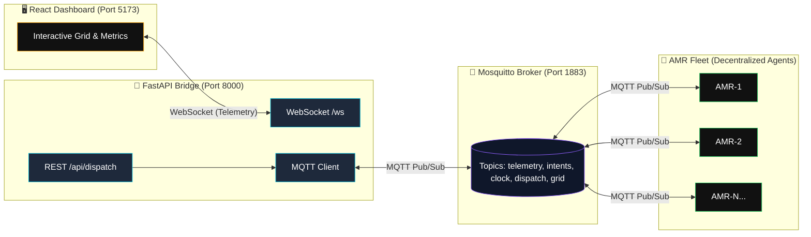

# 🚀 Decentralized AMR Fleet Coordination Framework - SIH 2026

[](https://opensource.org/licenses/MIT)
[](https://www.python.org/)
[](https://reactjs.org/)
[](https://www.docker.com/)

---

## Overview

This project implements an **edge-computed, decentralized fleet management system** for Autonomous Mobile Robots (AMRs) in warehouse environments. Designed for the **Smart India Hackathon (SIH) 2026**, it demonstrates how a fleet of robots can coordinate without a central path planner—each robot independently computes collision-free paths using **Time-Space A*** while sharing intent via **MQTT** for peer-to-peer negotiation. A **FastAPI + WebSocket** bridge provides real-time Command & Control (C2) visibility to a **React** dashboard.

### Key Capabilities
- **Zero central scheduler** — robots negotiate space-time reservations peer-to-peer
- **Provably safe** — vertex and edge collision avoidance via dynamic reservations
- **Reactive replanning** — instant path recalculation on dispatch or conflict
- **Production-ready stack** — containerized with Docker, observable via live telemetry

---

## ✨ Key Features

- **Decentralized Collision Avoidance** — Time-Space A* with vertex/edge conflict checks against peer reservations
- **Dynamic Replanning** — Automatic yield/replan when conflicts detected (higher ID yields)
- **Live Battery Telemetry** — Simulated drain (0.5%/move, 0.1%/idle) with visual progress bars
- **Interactive UI Dispatch (C2)** — Click any grid cell to dispatch selected robot via REST → MQTT → Agent
- **Real-time Dashboard** — WebSocket-fed 10×10 grid, per-robot metrics, message log

---

## 🏗 Architecture



### Data Flow
1. **Simulator** publishes clock ticks → all agents advance
2. **Agents** plan paths → broadcast `fleet/intents` (space-time reservations)
3. **Peers** receive intents → update `dynamic_reservations` → avoid conflicts
4. **Agents** publish `fleet/telemetry` → FastAPI bridges to WebSocket → Dashboard
5. **Operator** clicks grid → REST `/api/dispatch/{id}` → MQTT `fleet/dispatch/{id}` → Agent replans

---

## 🚀 Quick Start (Docker)

```bash
# Clone and enter
git clone https://github.com/SoulViper07/sih-amr-fleet.git
cd sih-amr-fleet

# Build and run all services
docker-compose up --build
```

| Service | URL |
|---------|-----|
| **Dashboard** | http://localhost:5173 |
| **API Docs (Swagger)** | http://localhost:8000/docs |
| **MQTT Broker** | localhost:1883 |

> **Note:** Ensure ports 1883, 5173, 8000 are free. On first run, Docker will pull images and install dependencies (~2-3 min).

---

## 🛠 Local Development (3-Terminal Setup)

### Terminal 1 — MQTT Broker
```bash
# Option A: Docker (recommended)
docker run -d -p 1883:1883 -v $(pwd)/mosquitto.conf:/mosquitto/config/mosquitto.conf eclipse-mosquitto:latest

# Option B: Local install
mosquitto -c mosquitto.conf -v
```

### Terminal 2 — FastAPI Bridge + Simulator
```bash
cd sih-amr-fleet
python -m venv venv && source venv/bin/activate  # Windows: venv\Scripts\activate
pip install -r requirements.txt

# Start API bridge (background)
uvicorn backend.api:app --host 0.0.0.0 --port 8000 --reload &

# Run simulation coordinator (sends clock ticks)
python scripts/sim_runner.py
```

### Terminal 3 — React Dashboard
```bash
cd sih-amr-fleet/frontend
npm install
npm run dev
# Opens http://localhost:5173
```

---

## 🧪 Testing the System

1. Open **Dashboard** at http://localhost:5173
2. Verify **Live** indicator (green) and two robots on grid (AMR-1 at left, AMR-2 at top)
3. Click **Commander Controls** → Select **AMR-1** or **AMR-2**
4. Click any **empty grid cell** → Robot replans and moves to target
5. Watch **battery bars** drain in real-time (green → amber → red)
6. Observe **conflict resolution** at intersection (5,5) — one robot yields

---

## 📁 Project Structure

```
sih-amr-fleet/
├── backend/
│   ├── agents/amr.py           # AMR Agent: MQTT, Time-Space A*, battery, dispatch
│   ├── algorithms/time_space_astar.py  # Core pathfinding algorithm
│   ├── world/grid.py           # WarehouseGrid environment
│   └── api.py                  # FastAPI + WebSocket + MQTT bridge
├── frontend/
│   └── src/App.jsx             # React Dashboard (Vite + Tailwind)
├── scripts/sim_runner.py       # Coordinator: clock ticks, spawns agents
├── docker-compose.yml          # 3-service stack
├── Dockerfile.backend          # Python API container
├── frontend/Dockerfile.frontend # Node UI container
├── mosquitto.conf              # MQTT broker config
└── requirements.txt            # Python dependencies
```

---

## 🔧 Tech Stack

| Layer | Technology |
|-------|------------|
| **Pathfinding** | Time-Space A* (Manhattan heuristic, max_time horizon) |
| **Messaging** | MQTT 3.1.1 (paho-mqtt), Mosquitto Broker |
| **Real-time API** | FastAPI, WebSockets, Uvicorn |
| **Frontend** | React 18, Vite, Tailwind CSS, lucide-react |
| **Containerization** | Docker, Docker Compose |
| **Language** | Python 3.10+, JavaScript/ESM |

---

## 📄 License

MIT License — Copyright (c) 2026 **SIH CodeSprint Team**

Permission is hereby granted, free of charge, to any person obtaining a copy of this software and associated documentation files (the "Software"), to deal in the Software without restriction...